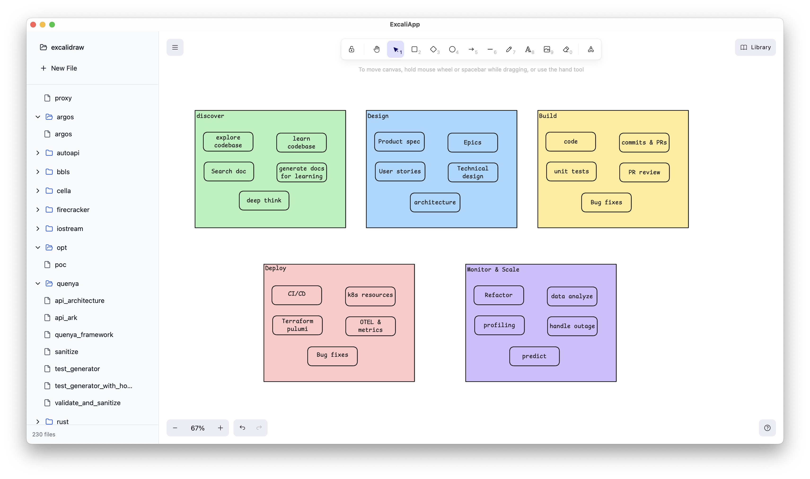
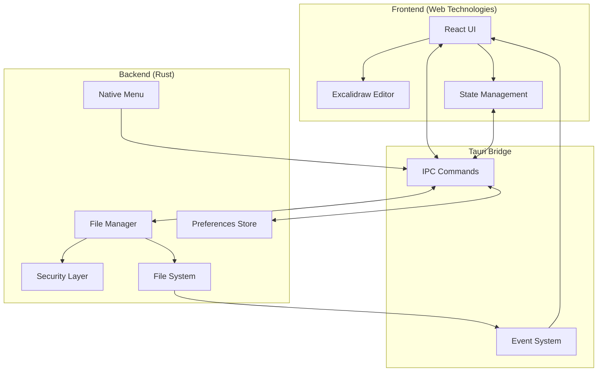
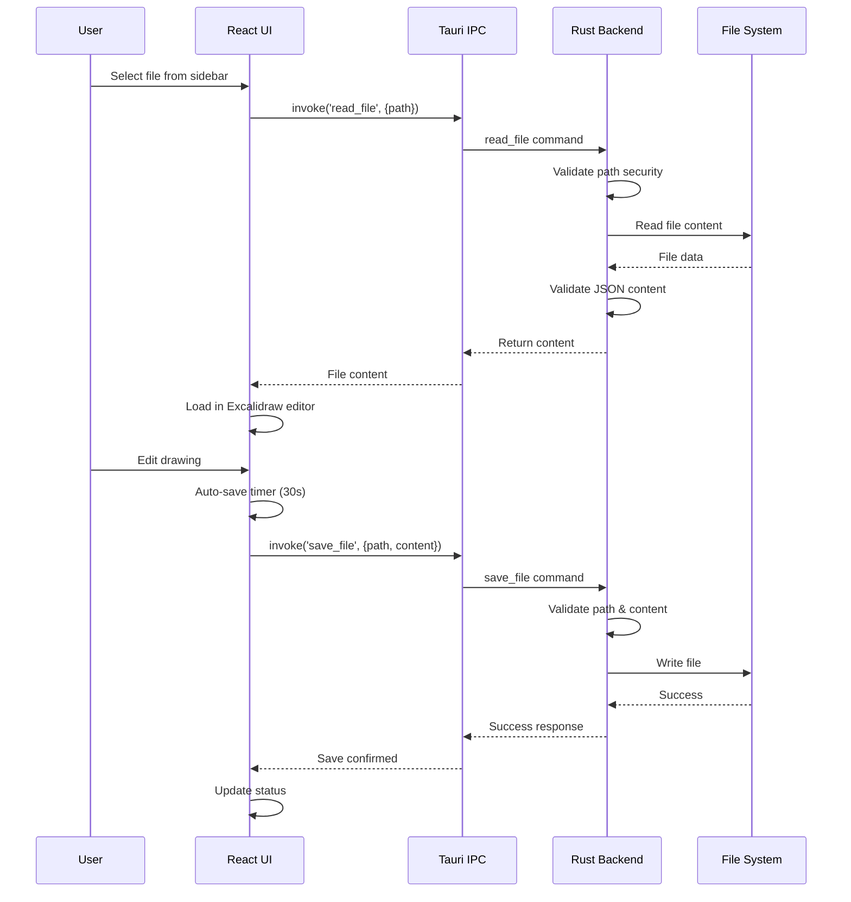

# ExcaliApp - Excalidraw Desktop Editor

A free, open-source desktop application for managing and editing local Excalidraw files. Built with Tauri for a native desktop experience while maintaining the familiar Excalidraw interface. See [中文说明](README-zh.md) for Chinese users.



## Features

- 📁 **Local File Management**: Browse and organize your Excalidraw files directly from your filesystem
- 🎨 **Full Excalidraw Editor**: Complete drawing and diagramming capabilities with the official Excalidraw editor
- 💾 **Auto-Save**: Never lose your work with automatic saving every 30 seconds
- 📑 **Tab System**: Open multiple files as tabs for quick switching between drawings
- 🎯 **Presentation Mode**: Present your drawings with a built-in laser pointer (F5)
- 🌲 **Tree View Navigation**: Hierarchical file browser for better organization
- 🎭 **Native Menus**: Platform-specific menus with keyboard shortcuts (toggleable)
- 🌓 **Theme Support**: Light, dark, and system theme options with full dark mode UI
- 🖥️ **Chromeless Mode**: Hide title bar and menus for a distraction-free experience
- 🔒 **Security First**: Path validation and content sanitization for safe file operations

## Installation

### Download Pre-built Binaries

Download the latest version from the [Releases page](https://github.com/tyrchen/excaliapp/releases/latest).

- **macOS Apple Silicon**: download `ExcaliApp-<version>-macos-arm64.dmg`, open it, then drag ExcaliApp into Applications.
- **Windows x86_64**: download `ExcaliApp-<version>-windows-x86_64-setup.exe` and run the installer.
- **Linux x86_64**: download `ExcaliApp-<version>-linux-x86_64.AppImage`, make it executable, then run it:

```bash
chmod +x ExcaliApp-*-linux-x86_64.AppImage
./ExcaliApp-*-linux-x86_64.AppImage
```

macOS builds currently target Apple Silicon only.
The Windows installer is currently unsigned, so Microsoft Defender SmartScreen may display a warning.

### Build from Source

#### Prerequisites

- [Node.js](https://nodejs.org/) 24
- [Rust](https://www.rust-lang.org/) (latest stable)
- Platform-specific build tools:
  - **Windows**: Visual Studio 2022 Build Tools with the **Desktop development with C++** workload and Microsoft Edge WebView2
  - **macOS**: Xcode Command Line Tools
  - **Linux**: Tauri's [Linux system dependencies](https://v2.tauri.app/start/prerequisites/#linux)

#### Build Steps

```bash
# Clone the repository
git clone https://github.com/tyrchen/excaliapp.git
cd excaliapp

# Install dependencies
npm ci

# Development mode with hot reload
npm run tauri dev

# Build for production
npm run tauri build
```

The built application will be in `src-tauri/target/release/bundle/`

## Usage

### Getting Started

1. **Launch the Application**: Open ExcaliApp from your applications folder or run the executable

2. **Select a Directory**:
   - On first launch, you'll be prompted to select a folder containing your Excalidraw files
   - The app remembers your last selected directory for future sessions
   - Use `File > Open Directory` (Ctrl/Cmd+O) to change directories anytime

3. **Create or Edit Files**:
   - Click "New File" or use `File > New File` (Ctrl/Cmd+N) to create a new drawing
   - Click any file in the sidebar to open it as a tab
   - Your changes are automatically saved every 30 seconds

4. **Navigate Between Files**:
   - Use the tree view sidebar to browse your file structure
   - Open files appear as tabs above the editor
   - Click tabs or use Ctrl+Tab to switch between open drawings

5. **Present Your Drawings**:
   - Press F5 to enter presentation mode
   - All editing UI is hidden, leaving only your drawing and tabs
   - A laser pointer follows your cursor for highlighting content
   - Press Escape or F5 again to exit

### Keyboard Shortcuts

| Action                    | Windows/Linux       | macOS            |
| ------------------------- | ------------------- | ---------------- |
| New File                  | Ctrl+N              | Cmd+N            |
| Open Directory            | Ctrl+O              | Cmd+O            |
| Save                      | Ctrl+S              | Cmd+S            |
| Save As                   | Ctrl+Shift+S        | Cmd+Shift+S      |
| Toggle Sidebar            | Ctrl+B              | Cmd+B            |
| Close Tab                 | Ctrl+W              | Cmd+W            |
| Next Tab                  | Ctrl+Tab            | Cmd+Tab          |
| Previous Tab              | Ctrl+Shift+Tab      | Cmd+Shift+Tab    |
| Presentation Mode         | F5                  | F5               |
| Exit Presentation         | Escape              | Escape           |
| Toggle Title Bar & Menu   | Ctrl+Shift+D        | Cmd+Shift+D      |
| Quit                      | Ctrl+Q              | Cmd+Q            |

### File Operations

- **Create**: Click "New File" button or use menu/shortcut
- **Rename**: Right-click on a file and select "Rename"
- **Delete**: Right-click on a file and select "Delete"
- **Auto-save**: Files are automatically saved every 30 seconds and when switching between files

### Presentation Mode

ExcaliApp includes a presentation mode designed for teaching and presenting diagrams:

- **Enter**: Press **F5** to activate presentation mode
- **Laser Pointer**: A red laser pointer dot follows your cursor with a fading trail, perfect for highlighting elements during presentations
- **Tab Navigation**: Tabs remain visible so you can switch between drawings during your presentation
- **Clean UI**: All editing toolbars, sidebar, and menus are hidden for a distraction-free view
- **Exit**: Press **Escape** or **F5** again to return to editing

### Chromeless Mode

For tiling window managers (Hyprland, i3, Sway) or users who prefer a minimal UI:

- Press **Cmd+Shift+D** to toggle the title bar and native menus
- This preference persists across sessions
- All functionality remains accessible via keyboard shortcuts

## Architecture

### High-Level Architecture



### Component Interaction Flow



### Technology Stack

- **Desktop Framework**: [Tauri 2.x](https://tauri.app/) - Rust-based framework for building native desktop apps
- **Frontend Framework**: [React 19](https://react.dev/) with TypeScript
- **Drawing Engine**: [@excalidraw/excalidraw](https://github.com/excalidraw/excalidraw)
- **Build Tool**: [Vite](https://vitejs.dev/)
- **UI Components**: [shadcn/ui](https://ui.shadcn.com/) with [Tailwind CSS](https://tailwindcss.com/)
- **State Management**: [Zustand](https://github.com/pmndrs/zustand) with persistent preferences

### Security Features

- **Path Traversal Protection**: All file paths are validated and canonicalized
- **File Type Validation**: Only `.excalidraw` files can be read/written
- **Content Validation**: JSON structure is validated before saving
- **Sandboxed File Access**: Tauri's security model restricts file system access

## Development

### Project Structure

```
excaliapp/
├── src/                    # React frontend
│   ├── components/         # React components
│   │   ├── Sidebar.tsx    # File browser sidebar
│   │   ├── TreeView.tsx   # Hierarchical file tree
│   │   ├── TabBar.tsx     # Tab bar for open files
│   │   ├── LaserPointer.tsx # Presentation laser pointer
│   │   └── ExcalidrawEditor.tsx # Editor wrapper
│   ├── hooks/             # Custom React hooks
│   ├── lib/               # Utilities
│   └── App.tsx            # Main application
├── src-tauri/             # Rust backend
│   ├── src/
│   │   ├── main.rs        # Entry point
│   │   ├── lib.rs         # Core logic & commands
│   │   ├── menu.rs        # Native menu setup
│   │   └── security.rs    # Security validations
│   └── tauri.conf.json    # Tauri configuration
└── package.json           # Node dependencies
```

### Available Scripts

```bash
# Start development server
npm run dev

# Run Tauri in development mode
npm run tauri dev

# Build for production
npm run tauri build

# Type checking
npm run type-check

# Format code
npm run format
```

## Contributing

Contributions are welcome! Please feel free to submit a Pull Request.

1. Fork the repository
2. Create your feature branch (`git checkout -b feature/amazing-feature`)
3. Commit your changes (`git commit -m 'Add some amazing feature'`)
4. Push to the branch (`git push origin feature/amazing-feature`)
5. Open a Pull Request

## License

MIT License - see [LICENSE](LICENSE) file for details

## Acknowledgments

- [Excalidraw](https://excalidraw.com/) for the amazing drawing engine
- [Tauri](https://tauri.app/) for the desktop framework
- The open-source community for continuous inspiration
